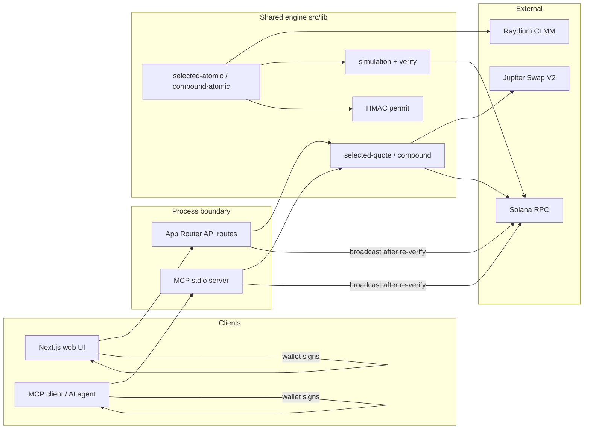

# SoFinance

Non-custodial Solana tooling for **Raydium CLMM** liquidity: zap any eligible wallet asset into a position via Jupiter, and compound fees/rewards back in—with the same safety gates for humans and AI agents.

One shared engine in `src/lib` powers:

- a **Next.js web app** (wallet connect → quote → sign → broadcast)
- an **MCP server** (`src/mcp/`) that returns **unsigned v0 transactions** for agents to sign

The server never holds private keys. Agents/users sign locally; broadcast re-verifies an HMAC permit and re-simulates before send.

## Features

- Discover Raydium CLMM position NFTs and eligible ATA / native SOL balances
- **Add-liquidity zap**: Jupiter Swap V2 + Raydium `increase_liquidity_v2` in one simulated v0 tx
- Configurable **add-liquidity price tolerance** (default 1%, cap 5%) so pool drift does not trip Raydium `PriceSlippageCheck` (6017); unused reserve stays in the wallet
- **Resale-ratio floor** (default 99%): conservative quote of swapping position outputs back to the same input asset
- **One-click compound**: harvest fees/rewards, swap to range ratio, reinvest (phase one rejects third reward mints without a verifiable path)
- Web UI Advanced settings for resale gap and price tolerance; MCP exposes the same knobs
- **Position performance / realized fee APR**: holding-period return from on-chain open/increase/decrease events + current equity (not Raydium pool 24h feeApr) — MCP `get_position_performance`, `/api/position-performance`, `/position-performance` UI
- **Same-asset RWA pair discovery**: Raydium CLMM pools where both sides are the same underlying (e.g. `MSTRx`/`MSTR`, `NVDAx`/`NVDA`), filtered by Jupiter Tokens API tags (`stocks`|`rwa`) plus Backed xStocks whitelist, with fee tier, TVL, 24h volume/fees, estimated fee APR, Token-2022 / freeze flags — MCP `list_rwa_pairs` and read-only `/rwa-pairs` UI

## Safety gates

Kept on both web API and MCP paths:

| Gate | Role |
|------|------|
| Price-impact cap | 5% vs probe route (`MAX_PRICE_IMPACT_BPS`) |
| Resale-ratio floor | 95–100% in 0.1% steps (default 99%) |
| Jupiter swap slippage | Fixed 0.5% |
| Add-liquidity tolerance | 0–5% (default 1%); pads `amountMax`, shrinks liquidity |
| 1,232-byte limit | Rejects oversized v0 messages |
| Full simulation | Exact liquidity delta + balance checks before signing |
| HMAC permit | Binds message, wallet, selection, amounts, floor, starting state |
| Re-verify | On submit: permit, on-chain state, re-simulate, then broadcast |

## MCP tools (9)

| Tool | Purpose | Key params |
|------|---------|------------|
| `get_position_performance` | Holding-period return / fee APR from chain events | `positionMint`, `wallet?`, `maxSignatures?`, `skipPricing?` |
| `list_positions` | Positions + eligible assets | `wallet` |
| `quote_add_liquidity` | Read-only zap quote | `wallet`, `positionMint`, `inputMint`, `inputKind` (`native`\|`token`), `amount`, `resaleFloorBps?` (9500–10000, default 9900), `slippageToleranceBps?` (0–500 step 10, default 100) |
| `prepare_transaction` | Unsigned zap tx + permit + `submitArgs` | same as quote |
| `submit_signed_transaction` | Permit check → re-sim → broadcast | `signedTransaction` + every `submitArgs` field unchanged |
| `quote_compound` | Compound quote | `wallet`, `positionMint`, `sourceSignatures?` (≤3) |
| `prepare_compound_transaction` | Unsigned compound tx + permit | same as quote_compound |
| `submit_compound_transaction` | Permit check → re-sim → broadcast | `signedTransaction`, `permit`, `wallet`, full `summary` unchanged |

## Quickstart — web

```bash
pnpm install
cp .env.example .env.local
# Server-only: SOLANA_RPC_URL, JUPITER_API_KEY
# Public: NEXT_PUBLIC_REOWN_PROJECT_ID (and optional NEXT_PUBLIC_SOLANA_RPC_URL without secrets)
pnpm dev --webpack --hostname 127.0.0.1
```

```bash
pnpm lint && pnpm typecheck && pnpm test && pnpm build
```

Never commit `.env.local`, mnemonics, or API keys. Do not prefix `SOLANA_RPC_URL` / `JUPITER_API_KEY` with `NEXT_PUBLIC_`.

## Quickstart — MCP (Claude Desktop / Cursor)

Requires Node 20+, `pnpm install` in this repo, and the same server env vars.

Example Cursor / Claude MCP config (adjust the absolute path):

```json
{
  "mcpServers": {
    "sofinance": {
      "command": "npx",
      "args": ["tsx", "src/mcp/server.ts"],
      "cwd": "/absolute/path/to/sofinance-public",
      "env": {
        "SOLANA_RPC_URL": "https://your-solana-rpc",
        "JUPITER_API_KEY": "your-jupiter-key"
      }
    }
  }
}
```

Or: `pnpm mcp:start` with env already exported.

**Agent flow:** `list_positions` → `quote_add_liquidity` → `prepare_transaction` → wallet signs `unsignedTransaction` → `submit_signed_transaction` with `{ signedTransaction, ...submitArgs }`. Compound: `quote_compound` / `prepare_compound_transaction` → sign → `submit_compound_transaction` with the complete `summary`.

`JUPITER_API_KEY` is also the HMAC secret for permits. Quotes expire quickly; always re-prepare before signing.

## Architecture



Stack: Next.js 16 / React 19 / TypeScript / pnpm / Vitest; `@raydium-io/raydium-sdk-v2`, Jupiter `/swap/v2/build`, `@solana/web3.js`, Zod, MCP SDK.


## RWA same-asset pairing

Discovers Raydium CLMM pools via the official API (`/pools/info/list?poolType=concentrated`) where both mints are the same underlying asset:

1. **Structural**: symbols form a wrap pair `FOOx`/`FOO`, `FOO-x`/`FOO`, or `xFOO`/`FOO` (stablecoin bases excluded)
2. **Primary**: both mints have Jupiter Tokens API tags including `stocks` **or** `rwa` (`GET /tokens/v2/search?query={mint}`; optional `JUPITER_API_KEY`). Preferred tags `xstocks` / `backpack` are noted when present but not required
3. **Secondary**: Backed xStocks public assets whitelist (`https://api.xstocks.fi/api/v2/public/assets`, Solana deployments) so known Backed mints still qualify if Jupiter tags lag

Name heuristics are not used as the primary filter. Annotated with fee tier, TVL, 24h volume/fees, Raydium `feeApr`, and **estimated fee APR** = `(24h fees / TVL) × 365 × 100` (labeled in API/UI; not a promise of LP returns). Freeze / Token-2022 flags come from Raydium mint metadata tags/program ids.


## Position performance (realized fee APR)

Computes a position NFT's **actual holding-period return** from on-chain facts (no database):

1. `getSignaturesForAddress` on the Raydium `PersonalPositionState` PDA
2. Parse Anchor events from logs: `CreatePersonalPositionEvent`, `IncreaseLiquidityEvent`, `DecreaseLiquidityEvent` (exact deposit / principal-out / fee-out amounts)
3. Current equity = liquidity token amounts (`LiquidityMath`) + uncollected fees (fee-growth accrual, same math as compound)
4. Metrics: `holdingDays`, deposited / withdrawn / fees, PnL, `holdingPeriodReturnPct`, `annualizedReturnPct` (simple ×365/days), `feeOnlyAprPct`
5. Optional USD via Jupiter Price API v3 **at evaluation time** (explicitly labeled — not historical tx-time prices)

This is **not** Raydium's pool `day.feeApr`. Read-only UI: `/position-performance`.

## Limitations

- Raydium **CLMM** positions held directly by the wallet only (not staked, not Orca/Meteora)
- Single-signer v0 transactions; routes that write unrelated non-zero token accounts are rejected
- Quotes and permits expire; blockhash / state changes void a prepare
- Phase-one compound rejects positions with a third reward token lacking a verifiable isolated swap path
- Jupiter free-tier rate limits and public RPC 429s can interrupt quotes; use a dedicated RPC in production

## Roadmap

- Broader Token-2022 / fee / reward coverage for compound
- Clearer agent-facing error codes and recovery hints
- Optional ALT / route shaping to reduce 1232-byte failures on heavy Jupiter paths
- More pool venues only if the same simulation + permit model can be preserved

## License

[MIT](./LICENSE)

## Hackathon disclosure

Built for the **Colosseum Crypto World's Fair** (Public Goods track).

Original private repository [`truenorth-lj/SoFinance`](https://github.com/truenorth-lj/SoFinance) first commit **2026-09-29** (`chore: scaffold USDC position zap project`, author date `2026-09-29T02:09:15Z`), within the Sep 14–Oct 12 PT hackathon window. This public repository (`truenorth-lj/sofinance-public`) was created **2026-10-06** with a fresh history so hardcoded personal wallet addresses could be removed and documentation published in English. Read access to the original private repo will be granted to `hackathon@colosseum.com` for verification.

Development used the author’s own pre-built generic agent skill (a “research-pipeline” skill) and AI coding assistants as tooling—not pre-hackathon product code.
