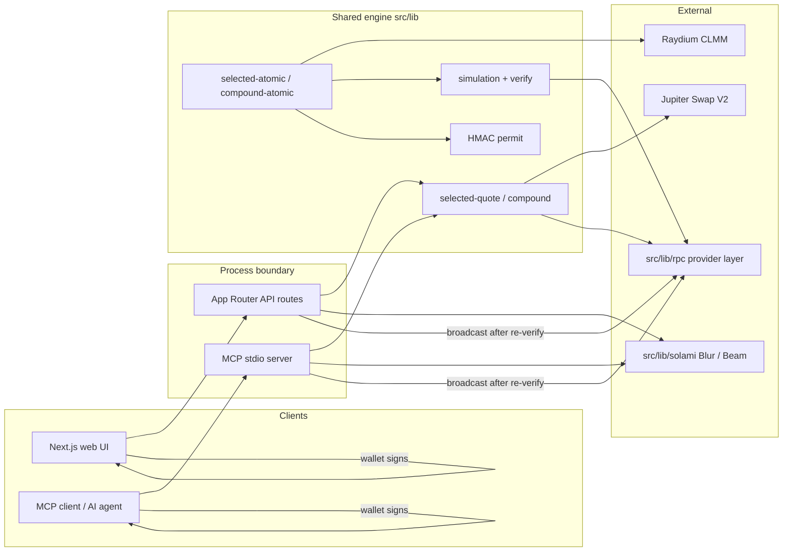
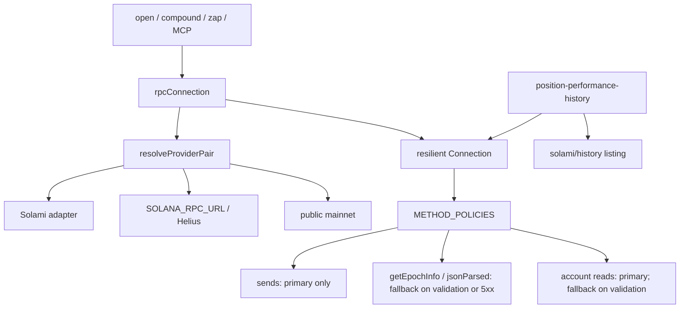

# SoFinance

Non-custodial Solana tooling for **Raydium CLMM** liquidity: zap any eligible wallet asset into a position via Jupiter, and compound fees/rewards back in—with the same safety gates for humans and AI agents.

One shared engine in `src/lib` powers:

- a **Next.js web app** (wallet connect → quote → sign → broadcast)
- an **MCP server** (`src/mcp/`) that returns **unsigned v0 transactions** for agents to sign

The server never holds private keys. Agents/users sign locally; broadcast re-verifies an HMAC permit and re-simulates before send.

The marketing landing page lives at `/`. Product UI lives under `/app` (Positions, Plan, RWA pairs, position performance, Use AI, and sign deep-links). `/api/*` is unchanged.

| Old path | New path |
|----------|----------|
| `/` (app home) | `/app` |
| `/rwa-pairs` | `/app/rwa-pairs` |
| `/position-performance` | `/app/position-performance` |
| `/ai` | `/app/ai` |
| `/sign/<token>` | `/app/sign/<token>` |

Former page paths permanently redirect. MCP `prepare_*` tools now emit `/app/sign/<token>`.

## Features

- Discover Raydium CLMM position NFTs and eligible ATA / native SOL balances
- **Add-liquidity zap**: Jupiter Swap V2 + Raydium `increase_liquidity_v2` in one simulated v0 tx
- Configurable **add-liquidity price tolerance** (default 1%, cap 5%) so pool drift does not trip Raydium `PriceSlippageCheck` (6017); unused reserve stays in the wallet
- **Resale-ratio floor** (default 99%): conservative quote of swapping position outputs back to the same input asset
- **One-click compound**: harvest fees/rewards, swap to range ratio, reinvest (phase one rejects third reward mints without a verifiable path)
- Web UI Advanced settings for resale gap and price tolerance; MCP exposes the same knobs
- **Position performance / realized fee APR**: holding-period return from on-chain open/increase/decrease events + current equity (not Raydium pool 24h feeApr). Same-asset RWA pairs prefer **token-equivalent (TE)** in the plain/base ticker via current tick mid (raw A/B + TE; USD secondary) — MCP `get_position_performance`, `/api/position-performance`, `/app/position-performance` UI
- **Live pool activity (Solami Blur)**: pool stats, swap ticker (Solscan links), and live in-range / near-edge status from the latest Blur price versus the position ticks — `/app` + `/app/position-performance`, MCP `get_pool_activity` / `get_position_range_status`
- **Same-asset RWA pair discovery**: Raydium CLMM pools where both sides are the same underlying (e.g. `MSTRx`/`MSTR`, `NVDAx`/`NVDA`), filtered by Jupiter Tokens API tags (`stocks`|`rwa`) plus Backed xStocks whitelist, with fee tier, TVL, 24h volume/fees, estimated fee APR, Token-2022 / freeze flags — MCP `list_rwa_pairs` and `/app/rwa-pairs` UI
- **Open CLMM position**: create a new Raydium concentrated position from `/app/rwa-pairs` (Add liquidity) or MCP `quote_open_position` / `prepare_open_position` / `submit_open_position`, with Jupiter swap-to-ratio, range presets, and the same quote → prepare → sign → re-sim gates. No need to open the NFT on raydium.io first. The position NFT mint is an ephemeral server-side Keypair: it partial-signs the v0 message after the fresh blockhash restamp, then the secret is zeroed in memory and never logged or persisted. The wallet signs as fee payer; `/app/sign/<token>` restores that extra signature if the wallet drops it. Dedicated `submit_open_position` (not `submit_signed_transaction`) because this message has two required signers.

## Safety gates

Kept on both web API and MCP paths:

| Gate | Role |
|------|------|
| Price-impact cap | 5% vs probe route (`MAX_PRICE_IMPACT_BPS`) |
| Resale-ratio floor | 95–100% in 0.1% steps (default 99%) |
| Jupiter swap slippage | Fixed 0.5% |
| Add-liquidity tolerance | 0–5% (default 1%); pads `amountMax`, shrinks liquidity |
| 1,232-byte limit | Rejects oversized v0 messages |
| Full simulation | Exact liquidity delta + balance checks before signing |
| HMAC permit | Binds message, wallet, selection, amounts, floor, starting state |
| Re-verify | On submit: permit, on-chain state, re-simulate, then broadcast |

## MCP tools (14)

| Tool | Purpose | Key params |
|------|---------|------------|
| `get_position_performance` | Holding-period / fee APR from chain; TE for same-asset RWA wrap pairs | `positionMint`, `wallet?`, `maxSignatures?`, `skipPricing?` |
| `get_pool_activity` | Live Solami Blur pool snapshot + recent swaps (`available: false` without a data key) | `poolId`, `limit?` |
| `get_position_range_status` | In/out of range from Blur pool price vs position ticks; near-edge flag | `positionMint`, `wallet?`, `poolId?` |
| `list_positions` | Positions + eligible assets | `wallet` |
| `quote_add_liquidity` | Read-only zap quote | `wallet`, `positionMint`, `inputMint`, `inputKind` (`native`\|`token`), `amount`, `resaleFloorBps?` (9500–10000, default 9900), `slippageToleranceBps?` (0–500 step 10, default 100) |
| `prepare_transaction` | Unsigned zap tx + permit + `submitArgs` + `signUrl` | same as quote |
| `submit_signed_transaction` | Permit check → re-sim → broadcast | `signedTransaction` + every `submitArgs` field unchanged |
| `quote_compound` | Compound quote | `wallet`, `positionMint`, `sourceSignatures?` (≤3) |
| `prepare_compound_transaction` | Unsigned compound tx + permit + `signUrl` | same as quote_compound |
| `submit_compound_transaction` | Permit check → re-sim → broadcast | `signedTransaction`, `permit`, `wallet`, full `summary` unchanged |
| `list_rwa_pairs` | Discover same-asset RWA pairs; includes `openPositionUrl` + `recommendedRanges`. Defaults `maxPages=3`; uses the in-memory cache when warm | `minTvl?`, `maxPages?`, `sortBy?` |
| `quote_open_position` | Quote a **new** CLMM position (no existing NFT) | `wallet`, `poolId`, `inputMint`, `inputKind`, `amount`, `rangePreset?` (`tight`\|`standard`\|`wide`\|`custom`), `minPrice?`/`maxPrice?` (B per 1 A) |
| `prepare_open_position` | Unsigned open-position tx + permit + `signUrl` (NFT mint partial-signed) | same as quote_open_position |
| `submit_open_position` | Permit check → re-sim → broadcast (two signers: wallet + NFT mint) | `signedTransaction`, `permit`, `wallet`, full `summary` unchanged |

## Quickstart — web

```bash
pnpm install
cp .env.example .env.local
# Server-only: SOLANA_RPC_URL and/or SOLAMI_API_KEY, JUPITER_API_KEY
# Optional: SOLAMI_DATA_API_KEY (Blur; unused until the pool-activity layer)
# Public: NEXT_PUBLIC_REOWN_PROJECT_ID (and optional NEXT_PUBLIC_SOLANA_RPC_URL without secrets)
pnpm dev --webpack --hostname 127.0.0.1
```

```bash
pnpm lint && pnpm typecheck && pnpm test && pnpm build
```

Never commit `.env.local`, mnemonics, or API keys. Do not prefix `SOLANA_RPC_URL` / `SOLAMI_API_KEY` / `SOLAMI_DATA_API_KEY` / `JUPITER_API_KEY` with `NEXT_PUBLIC_`.

## Powered by Solami

[Solami](https://solami.dev) is optional Solana infrastructure. Bring your own keys — the app keeps working on `SOLANA_RPC_URL` or the public mainnet RPC when they are absent.

| Surface | When | What it does |
|---------|------|----------------|
| **RPC** | `SOLAMI_API_KEY` set | All server `rpcConnection()` traffic goes through `src/lib/rpc/` (Solami → `SOLANA_RPC_URL` / Helius → public). Account reads and sends stay on Solami. Methods Solami answers non-compliantly (`getEpochInfo.transactionCount=null`, `getParsedTransaction` jsonParsed unions) fall back per `METHOD_POLICIES`. Sends never retry. History listing uses Solami `getTransactionsForAddress`; empty / HTTP / parse failures use the same policy layer. |
| **Blur** | `SOLAMI_DATA_API_KEY` | Live pool activity. REST snapshot at `GET /api/pool-activity?poolId=` (`/data/pool` for mint + `GET /data/token/trades?chain=solana&address=<MINT>`, then client-filter by exact `pool`). SSE at `/api/pool-activity/stream` proxies Blur WS `type=swap,liquidity&pool=<POOL>` (never `address=` — that is a mint filter), forwards only parsed swap/liquidity events, and closes before Vercel `maxDuration` so the browser can reconnect. A Free key has REST but not WebSocket; [Solami](https://solami.dev) currently offers a 7-day Pro promo. Without the key the UI hides the panel. |
| **Beam** | `SOLAMI_API_KEY` (off with `SOLAMI_BEAM=0`) | Prepare adds a ≥100,000-lamport SystemProgram tip to a live tip address **before** HMAC binding so the user signs it. If the v0 message would exceed 1,232 bytes the tip is omitted. Broadcast is the same `sendRawTransaction` through Solami RPC. After submit we poll `GET /swqos/tx/{signature}` up to ~6s and always return `beamLandingUrl` so clients can refresh. |

Create a key at [solami.dev](https://solami.dev). Paste `SOLAMI_API_KEY` (and later `SOLAMI_DATA_API_KEY`) into `.env.local` or Vercel — never `NEXT_PUBLIC_*`. Position performance reports `{ txCount, elapsedMs, provider, solamiTxCount, defaultTxCount, fallbackReasons }` so you can see when Solami served recent txs and the default RPC filled older or unparseable ones.

```
wallet / API / MCP
        │
        ▼
 src/lib/rpc/ ── SOLAMI_API_KEY? ──► rpc.solami.dev
        │                    else ──► SOLANA_RPC_URL / public RPC
        ▼
 position-performance history
   solami: getTransactionsForAddress (signatures page) + batched getParsedTransaction
   fallback: SOLANA_RPC_URL / public (empty window, parse errors, HTTP 4xx/5xx)
   default: getSignaturesForAddress + batched getParsedTransaction (8-wide)
```

### Demo checklist (RPC layer)

1. Set `SOLAMI_API_KEY` only (no `SOLANA_RPC_URL`) and open `/app/position-performance`.
2. Compute performance for a real mainnet position NFT.
3. Confirm the history line shows a tx count / elapsed ms and either `solami` or `Solami for recent / fallback for older` (Solami's history window is limited; older txs come from the default RPC automatically).
4. Unset the key, restart, and confirm the same page still works via `SOLANA_RPC_URL` / public RPC with `provider: default`.
5. Set `SOLAMI_DATA_API_KEY`, open `/app` on a position, and confirm the Live pool activity panel (stats + Solscan ticker). A Free key fills the snapshot; Pro unlocks the SSE ticker. The demo Raydium CLMM SPCXx/SPCX pool `DUzBLHZ5RZdftPuWVijsvjupndogRM1adGJpsR7YTJro` (mint `Xs3oZwbHvqis4NYcf4YKWmEia2eC84wSiVrcYcTqpH8`) is often quiet — empty-state is expected; the global `dex=raydium_clmm` Blur stream is busy for sanity checks. Quiet pools still send SSE heartbeat comments.
6. Confirm `/app/position-performance` shows the same panel plus in-range / approaching-edge from Blur price vs ticks.
7. Unset the data key and confirm the panel disappears (no error banner).
8. With `SOLAMI_API_KEY` set, prepare a zap/compound/open and confirm the unsigned message includes a tip transfer (or is omitted only because of the 1,232-byte cap). After broadcast, the status dialog / MCP submit result may show `Landed via Beam · region · tip`.
9. Set `SOLAMI_BEAM=0` and confirm prepares still work with no tip.

## Quickstart — MCP for AI Agents (Remote, Zero Local Secrets)

**Recommended:** Use the remote MCP endpoint with zero local secrets. The MCP server runs on Vercel; your laptop needs only a connection URL + auth token.

### Getting Started (Remote MCP)

1. **Connect your wallet** on [sofinance-alpha.vercel.app/app](https://sofinance-alpha.vercel.app/app) (or `/app/ai`)
2. **Click "Sign to get MCP config"** — a WalletConnect session is not ownership proof. Each challenge nonce is single-use in-process (2-minute window). Vercel isolates do not share that store; a replay on a different isolate can still mint until the window expires.
3. **Sign the challenge message** in your wallet (proves you control the key)
4. **Copy the generated config** — includes a short-lived token bound to your wallet
5. **Paste into your AI agent:**

   **Cursor / Claude (if HTTP MCP supported):** Use the direct HTTP config

   **Cursor / Claude (if stdio only):** Use the zero-secret shim config

The UI shows both configs after you sign. Choose based on what your agent supports.

### Option A: Direct HTTP (Preferred)

If Cursor/Claude supports HTTP MCP with custom headers:

```json
{
  "mcpServers": {
    "sofinance": {
      "url": "https://sofinance-alpha.vercel.app/api/mcp",
      "headers": {
        "Authorization": "Bearer <your-token-here>"
      }
    }
  }
}
```

### Option B: Zero-Secret Shim (Fallback)

If your agent only supports stdio, use this shim that requires ZERO RPC/Jupiter secrets:

```json
{
  "mcpServers": {
    "sofinance": {
      "command": "npx",
      "args": ["tsx", "src/mcp/remote-shim.ts"],
      "cwd": "/absolute/path/to/sofinance-public",
      "env": {
        "SOFINANCE_MCP_URL": "https://sofinance-alpha.vercel.app/api/mcp",
        "SOFINANCE_MCP_TOKEN": "<your-token-here>"
      }
    }
  }
}
```

**Benefits:**
- ✅ Zero local secrets (no SOLANA_RPC_URL or JUPITER_API_KEY on laptop)
- ✅ Signature-verified tokens (prove wallet ownership before minting)
- ✅ Always up-to-date (talks to production Vercel backend)
- ✅ Short-lived tokens (24h expiry, regenerate anytime)
- ✅ Wallet-bound auth (token only works for your wallet)

**Agent flow:** `list_positions` → `quote_add_liquidity` → `prepare_transaction` → wallet signs locally → `submit_signed_transaction`. Open a new RWA position: `list_rwa_pairs` → `quote_open_position` → `prepare_open_position` → sign via `signUrl` → `list_positions`. Server never holds your private keys.

### Alternative: Local MCP (Power Users)

For local development or testing, you can run the MCP server locally:

```bash
pnpm install
pnpm mcp:start  # Requires SOLANA_RPC_URL and JUPITER_API_KEY in env
```

Cursor / Claude config for local stdio:

```json
{
  "mcpServers": {
    "sofinance": {
      "command": "npx",
      "args": ["tsx", "src/mcp/server.ts"],
      "cwd": "/absolute/path/to/sofinance-public",
      "env": {
        "SOLANA_RPC_URL": "https://your-solana-rpc",
        "JUPITER_API_KEY": "your-jupiter-key",
        "NEXT_PUBLIC_APP_URL": "https://sofinance-alpha.vercel.app"
      }
    }
  }
}
```

Or: `pnpm mcp:start` with env already exported.

**Agent flow:** `list_positions` → `quote_add_liquidity` → `prepare_transaction` → wallet signs `unsignedTransaction` → `submit_signed_transaction` with `{ signedTransaction, ...submitArgs }`. Compound: `quote_compound` / `prepare_compound_transaction` → sign → `submit_compound_transaction` with the complete `summary`. Open position: `list_rwa_pairs` → `quote_open_position` → `prepare_open_position` → sign → `submit_open_position` with the complete `summary`.

**Sign deep-link:** After `prepare_transaction`, `prepare_compound_transaction`, or `prepare_open_position`, the agent receives a `signUrl` (e.g. `https://sofinance-alpha.vercel.app/app/sign/<token>`) that can be opened in a browser. Legacy `/sign/<token>` URLs permanently redirect to `/app/sign/<token>`. The token is a self-contained, HMAC-signed, compressed payload containing the unsigned transaction, permit, and submit arguments. With the correct wallet connected via Reown AppKit, the user reviews the transaction summary and signs with one click. The signed transaction is automatically submitted via the existing re-verification and broadcast paths. This bridges the gap for agents that can prepare transactions but delegate signing to the user's wallet UI. Sign tokens expire after 60-120 seconds (matching permit/blockhash lifetime). The token is verified server-side using `JUPITER_API_KEY` as the HMAC secret, so MCP (local/remote) and Vercel (production) can share the same signing mechanism without shared memory.

`JUPITER_API_KEY` is used for Jupiter swap quotes, permit HMACs, sign token HMACs, and MCP token HMACs. Quotes expire quickly; always re-prepare before signing.
## Architecture



Stack: Next.js 16 / React 19 / TypeScript / pnpm / Vitest; `@raydium-io/raydium-sdk-v2`, Jupiter `/swap/v2/build`, `@solana/web3.js`, Zod, MCP SDK.

### RPC provider layer

Callers use `rpcConnection()` only. Provider selection, method policies, and fallback live in `src/lib/rpc/`. Solami product HTTP (Blur, Beam, `getTransactionsForAddress` parsers) lives in `src/lib/solami/`.



To add another JSON-RPC provider: append an entry to `RPC_PROVIDERS` in `src/lib/rpc/providers.ts` (id, endpoint from env, optional `customMethods`). To change when a web3.js method may leave Solami: edit `METHOD_POLICIES` in `src/lib/rpc/methods.ts`. Do not add provider if-statements in quote/send/MCP code.


## RWA same-asset pairing

Discovers Raydium CLMM pools via the official API (`/pools/info/list?poolType=concentrated`) where both mints are the same underlying asset:

1. **Structural**: symbols form a wrap pair `FOOx`/`FOO`, `FOO-x`/`FOO`, or `xFOO`/`FOO` (stablecoin bases excluded)
2. **Primary**: both mints have Jupiter Tokens API tags including `stocks` **or** `rwa` (`GET /tokens/v2/search?query={mint}`; optional `JUPITER_API_KEY`). Preferred tags `xstocks` / `backpack` are noted when present but not required
3. **Secondary**: Backed xStocks public assets whitelist (`https://api.xstocks.fi/api/v2/public/assets`, Solana deployments) so known Backed mints still qualify if Jupiter tags lag

Name heuristics are not used as the primary filter. Annotated with fee tier, TVL, 24h volume/fees, Raydium `feeApr`, and **estimated fee APR** = `(24h fees / TVL) × 365 × 100` (labeled in API/UI; not a promise of LP returns). Freeze / Token-2022 flags come from Raydium mint metadata tags/program ids.


## Position performance (realized fee APR)

Computes a position NFT's **actual holding-period return** from on-chain facts (no database):

1. Load personal-position history: Solami `getTransactionsForAddress` when `SOLAMI_API_KEY` is set (Solami's RPC history window is limited — empty pages and parse/validation errors fall back automatically to `SOLANA_RPC_URL` / public), otherwise `getSignaturesForAddress` plus bounded-parallel `getParsedTransaction` batches (not a sequential N+1 loop)
2. Parse Anchor events from logs: `CreatePersonalPositionEvent`, `IncreaseLiquidityEvent`, `DecreaseLiquidityEvent` (exact deposit / principal-out / fee-out amounts)
3. Current equity = liquidity token amounts (`LiquidityMath`) + uncollected fees (fee-growth accrual, same math as compound)
4. Metrics: `holdingDays`, deposited / withdrawn / fees, PnL, `holdingPeriodReturnPct`, `annualizedReturnPct` (simple ×365/days; **null when the position is younger than 24h**), `feeOnlyAprPct`
5. Optional USD via Jupiter Price API v3 **at evaluation time** (explicitly labeled — not historical tx-time prices)

This is **not** Raydium's pool `day.feeApr`. Read-only UI: `/app/position-performance`.

## Limitations

- Raydium **CLMM** positions held directly by the wallet only (not staked, not Orca/Meteora)
- Single-signer v0 transactions; routes that write unrelated non-zero token accounts are rejected
- Quotes and permits expire; blockhash / state changes void a prepare
- Phase-one compound rejects positions with a third reward token lacking a verifiable isolated swap path
- Jupiter free-tier rate limits and public RPC 429s can interrupt quotes; use a dedicated RPC in production

## Roadmap

- Broader Token-2022 / fee / reward coverage for compound
- Clearer agent-facing error codes and recovery hints
- Optional ALT / route shaping to reduce 1232-byte failures on heavy Jupiter paths
- More pool venues only if the same simulation + permit model can be preserved

## Custom domain / `app.` subdomain

Hobby `*.vercel.app` hosts cannot use a real `app.` subdomain, so this does nothing on [sofinance-alpha.vercel.app](https://sofinance-alpha.vercel.app). After you attach a custom domain (e.g. `sofinance.xyz`), also add `app.sofinance.xyz` in Vercel. `src/proxy.ts` (Next.js 16 Proxy, formerly middleware) rewrites `app.<domain>/<path>` → `/app/<path>` so the App can be served on the subdomain while the apex stays the landing page. `/api/*` is not rewritten. Until then, use `https://sofinance-alpha.vercel.app/app`.

## License

[MIT](./LICENSE)

## Hackathon disclosure

Built for the **Colosseum Crypto World's Fair** — entered in the **Solana track**, also eligible for the Public Goods Award and University Award.

Original private repository [`truenorth-lj/SoFinance`](https://github.com/truenorth-lj/SoFinance) first commit **2026-09-29** (`chore: scaffold USDC position zap project`, author date `2026-09-29T02:09:15Z`), within the Sep 14–Oct 12 PT hackathon window. This public repository (`truenorth-lj/sofinance-public`) was created **2026-10-06** with a fresh history so hardcoded personal wallet addresses could be removed and documentation published in English. Read access to the original private repo will be granted to `hackathon@colosseum.com` for verification.

Development used the author’s own pre-built generic agent skill (a “research-pipeline” skill) and AI coding assistants as tooling—not pre-hackathon product code.

## Local read-only LP decision analysis

`/app/plan` states a goal as one sentence of pills (when to cash out, how much to put in, what outcome matters, a loss alert and the exit asset) and judges it against the three sample market paths of the deterministic scenario engine. Sample numbers stay off until switched on, show no probabilities, and the page never touches the network. If the goal is out of reach it says so and offers a longer horizon or a smaller target; it does not raise risk to make the numbers work.

The verified ledger, same-cash-flow HODL comparison and unsigned USDC + SOL exit preview for a real position are on `/app/position-performance` once a position NFT mint is entered. That path reads verified public pool/position snapshots, raw transactions, USD daily candles and principal-only Jupiter route quotes. Complete net metrics remain unavailable until event-time USDC prices, flow attribution, full reconciliation and execution costs are verified. Public real fixtures and scoped liquidity/token/reward checks are reproducible; independent quote legs are not executable net recovery. Nothing in either page prepares or submits trades. See [implementation, acceptance and local preview](specs/lp-decision/IMPLEMENTATION.md); its notes on the earlier date/amount builder describe the UI that `/app/plan` replaced.
